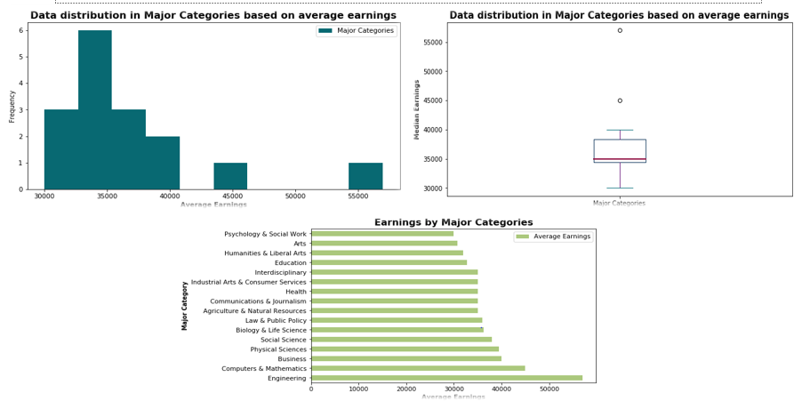
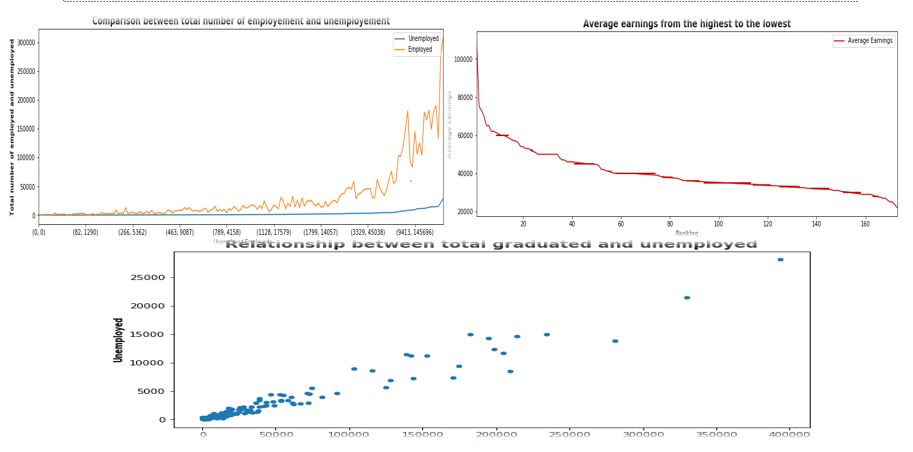
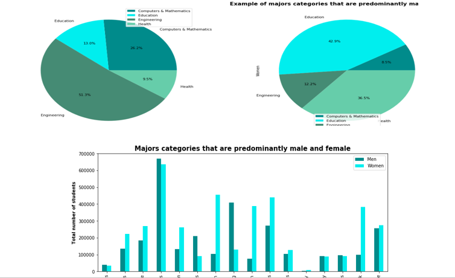

# Earnings-by-college-majors
Visualizing and analyzing data on earnings based on US college majors

## Table of contents
* [General info](#general-infos)
* [Screenshots](#screenshots)
* [Technologies](#technologies)
* [Findings](#findings)
* [Status](#status)
* [Contact](#contact)

## General info
This is an exploration data analysis on US college majors dataset. The project aim is to ease decision making while chosing college majors. Graphs are used for the explanatory analysis and also one way anova test is run to determine if there is a difference between the major category average earnings and if the difference is significant. The data has 173 observations and 19 variables.

## Screenshots

## Technologies
Programming Language: Python
Packages:
pandas
numpy
pandas_profiling
matplotlib.pyplot 
seaborn as sns
statsmodels.api 

## Findings
College majors with high and low median earnings 
College majors with high level of employment and unemployement rate
College majors that are predominantly male  and female 
Majors Categories with the most students
Association between college major category and income
Association between incomes Gender
significance in the difference in major categories average earnings.

## Status
Project is finished

## Contact
Can contact me via my mail. [missewoudiane@gmail.com](missewoudiane@gmail.com) 
